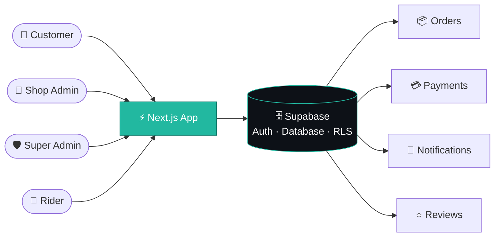

<!-- ═══════════════ HEADER ═══════════════ -->
<div align="center">


<a href="https://my-portfolio-blush-beta-77.vercel.app/">
  
</a>

<br/>

<a href="https://my-portfolio-blush-beta-77.vercel.app/"></a>
<a href="https://github.com/irfansfdev"></a>
<a href="https://www.linkedin.com/in/muhammad-irfan99"></a>
<a href="mailto:irfan.sfdev@gmail.com"></a>

</div>

<br/>

---

## 👨‍💻 About Me

<table>
<tr>
<td width="55%" valign="top">

I enjoy building **complete, functional web applications** rather than just UI screens: from database design and authentication to polished, responsive interfaces.

- 🎓 **BS Computer Science**, Iqra University
- 💼 **Full-Stack Developer** (React, Next.js, Django, Supabase)
- 🌱 Currently learning **Advanced Next.js**, **Supabase**, **Real-Time Apps** & **Salesforce Development**
- 🎯 Mindset: **Build. Learn. Improve.**

</td>
<td width="45%" valign="top">

```js
const irfan = {
  role: "Full-Stack Developer",
  focus: [
    "Full-stack architecture",
    "Auth & role-based access",
    "E-commerce & marketplaces",
    "Dashboards & workflows",
  ],
  stack: ["React", "Next.js", "Django", "Supabase"],
  mindset: "Build. Learn. Improve.",
};
```

</td>
</tr>
</table>

---

## 🛠️ Tech Stack

<div align="center">

**Frontend**


**Backend & Database**


**Tools**


</div>

---

## 💎 Featured Projects

<table>
<tr>
<td width="50%" valign="top">

### 🛍️ Multi-Vendor Marketplace
`Next.js` · `Supabase`

Multiple shops selling inside one platform, with separate customer, shop admin, super admin and rider workflows.

**Highlights**
- 🏪 Multi-shop / vendor system
- 📦 Order & payment workflow
- ⭐ Reviews & 🔔 notifications
- 📊 Admin analytics
- 🎯 Featured / approval system

</td>
<td width="50%" valign="top">

### 🏥 Hospital Management System
`Next.js` · `Supabase`

Role-based system built around different user workflows.

**Highlights**
- 👨‍⚕️ Doctor · 👤 Patient · 🛡️ Admin views
- 📅 Appointment management
- 📊 Dashboards
- 🔐 Authentication & role-based access

</td>
</tr>
<tr>
<td width="50%" valign="top">

### 🍔 FoodWeb: Food Ordering Platform
`React` · `Vite` · `Tailwind CSS` · `Django` · `PostgreSQL`

Full-stack food platform with a responsive frontend and a Django backend.

**Highlights**
- 🔐 User authentication
- 🍽️ Restaurant & menu functionality
- 🛒 Food ordering workflow
- 🔌 REST API integration
- 🚀 Frontend & backend deployment

</td>
<td width="50%" valign="top">

### 🎮 Multiplayer Drawing & Guessing Game
`Next.js` · `React` · `Supabase Realtime`

Real-time multiplayer game concept inspired by online drawing and guessing games.

**Highlights**
- 🎨 Real-time drawing
- 👥 Multiplayer rooms
- 💬 Live guessing & ⏱️ round timers
- 🏆 Scoring & 🔄 live player sync

</td>
</tr>
</table>

### 🧭 Marketplace Architecture at a Glance



---

## 🚀 What I Build

| | | |
|:--|:--|:--|
| 🧩 **Full-stack architecture** | 🔐 **Auth & role-based access** | 🗄️ **Database design & CRUD** |
| 🛒 **E-commerce & marketplaces** | 🏥 **Management systems** | ⚡ **Responsive, interactive UIs** |
| 🔄 **API integration** | 📊 **Admin dashboards** | 💼 **Business workflows** |

---

## 📚 Currently Learning

<div align="center">


</div>

---

## 🌱 Philosophy

<div align="center">

> **"Don't just write code. Build something useful with it."**

</div>

---

<div align="center">

### 🤝 Let's Connect

<a href="https://my-portfolio-blush-beta-77.vercel.app/"></a>
<a href="https://www.linkedin.com/in/muhammad-irfan99"></a>
<a href="mailto:irfan.sfdev@gmail.com"></a>


</div>
